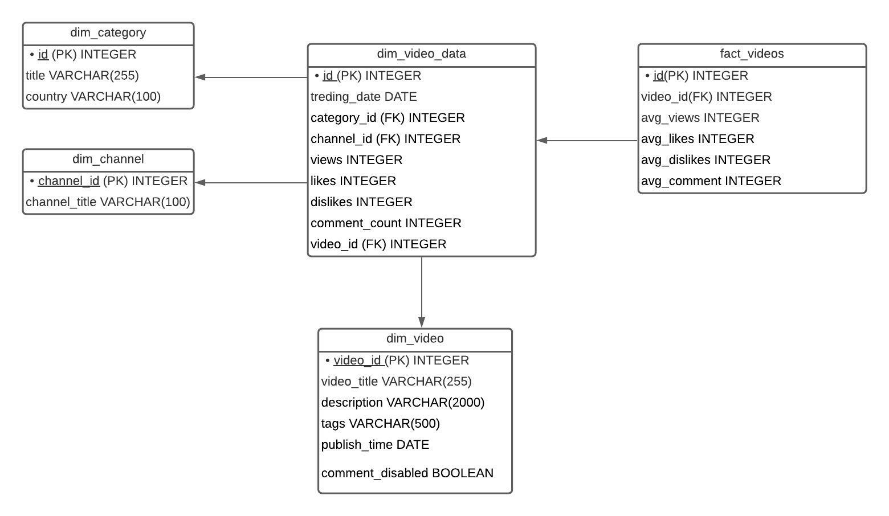

# OLAP Design for Youtube Trending Videos

## Business Requirement
We have data for the youtube trending videos on different dates.
- The domain for the project is an Youtube trending-list.
- Analyze the data of different videos on differnet :
 - dates
 - categories
 - country

# Dimension and Fact table determination.
The following are the possible  fact and dimensions:
- **dim_channel** (*channel_id*, channel_title)
- **dim_category** (*id*, title,country)
- **dim_video** (*video_id*, video_title,descrition,tags, publish_time,comment_disabled)
-**dim_video_data** (*id*, trending_date,category_id,channel_id, views,likes,dislikes,comment_count,video_id)
-**fact_videos** (*id*, video_id,avg_views,avg_likes,likes,avg_dislikes,avg_comment)

## Physical Implementation of fact and dimension tables.
In this section, we list out the possible domain and datatypes for each possible fileds in the database. The figure below depicts our data warehouse implementation in detail.

